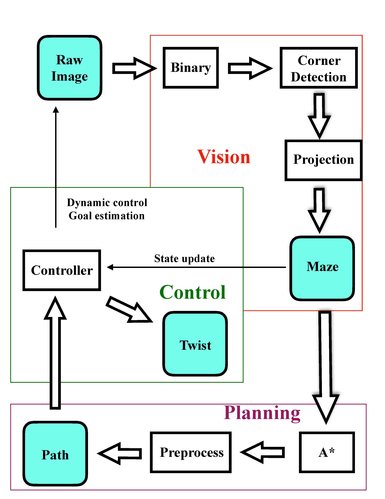

---
# Table of Contents
1. [Overview](#overview)
2. [Vision](#vision)
    - [Our Design and Decisions](#our-design-and-decisions)
    - [Design Choices and Trade-Offs](#design-choices-and-trade-offs)
    - [Analysis of Design](#analysis-of-design)
3. [Planning and Control](#planning-and-control)
    - [Our Design and Decisions](#our-design-and-decisions-1)
    - [Design Choices and Trade-Offs](#design-choices-and-trade-offs-1)
    - [Analysis of Design](#analysis-of-design-1)

---

## Overview

Because our goal from the beginning was to eventually make the path planning and control dynamic, we needed to constantly check the maze to see if the goal or the shortest path changed. At the general level, we decided to make a vision node, a planning node, and a control node. 
- The **vision** node would continuously receive the video feed from the camera, process it into a maze, and publish the maze. This node would also calculate appropriate transforms and pixel positions for control and publish those too. 
- The **planning** node would receive the maze and return a path through the maze.
- The **control** node would use the information from both the planning and vision nodes to set waypoints for the robot to follow, and would publish velocities to help the robot reach the waypoints. This would allow the robot to solve the maze

*
Diagram showing general overview of system
*

[(back to top)](#table-of-contents)

## Vision

When we initially went about designing this project, we wanted to be super lazy about setting up our environment. Ideally we would have liked to have an overhead camera, but that was really difficult to do logistically, and was also kind of limiting. We also did not want spend a lot of time moving our camera to a "perfect" position, or spend a lot of time setting up the maze. As a result, the vision needed to be quite robust to changes in our setup. Because we continuously ran the vision, it needed to be fast (work in realtime). While there were a few contraints we had to enforce on our setup, our group's design gave us a lot of freedom in setting up our maze.

[(back to top)](#table-of-contents)

# Our Design and Decisions
One of the most significant design choices our group made was using grid-based planning, along with variable positions and orientations for our camera. This meant that the computer vision needed to be able to simulate a top-down view of the maze. As a result our design focused heavily on robust corner detection. We also noticed that sometimes the Turtlebot would obscure parts of the maze from the camera's perspective, so we needed a way for vision to deal with that.

As a result, we put a lot of emphasis in detecting the corners of the maze, segmenting the maze, segmenting the turtlebot, and segmenting the AR Tag on top of the Turtlebot.

We also needed pixel positions of the goal, the AR Tag on the Turtlebot, and the base of the Turtlebot, but these were fairly easy to get using the TF package in ROS.

[(back to top)](#table-of-contents)

# Design choices and trade-offs
A problem during the corner detection of the maze that we struggled with was determining how to find the points that defined the bounding rectangle of our maze. Depending on the angle of the camera, the shape of the maze could look like a trapezoid, parallelogram, rectangle, etc. Additionally, depending on distance of the camera to the maze, the maze could be off-center in the camera perspective. It became difficult to find a good method to classify outermost corners of maze after classification.
Through some experimentation, we found that it became easier to find a method if we only considered clusters in a local region. K-means allows a flexible way to split the maze into four quadrants, regardless of the camera's position or orientation.

*
Illustration of how effective K-means is at splitting maze.
*

After finding these local regions, we took the points in each cluster and took the one with the maximum distance to the centroid of the outer corner points (forming the convex hull) as the outermost corner. Afterwards we sorted them based on x,y position to determine which corner we had. While this worked well most of the time, if the detected corners were weirdly imbalanced (like in the above picture), the point of comparison is not great. However, this method did work well most of the time.

Sometimes our method of corner detection was not perfect, and the vision would randomly become disturbed by noise in the image (from lighting or if someone walked in front of the camera). After that we decided to use a median filter on the corners to prevent random outliers from being too prevalent in the perspective shifting. This led to a tradeoff, in how quickly/often the corners would update versus how stable they were. If the camera shifted randomly (someone bumped into it), it could take a while for the corner points to change.

[(back to top)](#table-of-contents)

# Analysis of Design

Overall, our design for the vision was fairly reliable. You could pick up the camera and move it around, and it would still accurately output a grid, pixel positions, and transforms between the Turtlebot with respect to the goal. Something we did not have time to accont for, however, was if the Turtlebot obscured one of the corners of the maze. We also did not manage to make the control work with a moving camera. Vision would generally always publish a correct maze, but if you moved the camera around the maze, the corners flip and the grid rotates. This messes up some assumptions in control. We tried to always have the maze publish at a fixed orientation in vision, but keeping track of the orientation was too unreliable. Finally our method of gridding, though it worked well most of the time, was very naive, and we should have employed a probabilistic model that control could take advantage of.

[(back to top)](#table-of-contents)

## Planning and Control

The planner should be able to find the shortest path from the starting position to the goal position. To be robust, a planner must correctly handle cases like no path and multiple paths. The controller brings the TurtleBot to the desired position while following the shortest path returned by a planner.  We planned to create two controllers. One is a fixed path controller, which assumes that the environment of the TurtleBot stays invariant. The planner will compute the shortest path the first time when it receives a valid TurtleBot maze configuration, and the system will memorize the path. Another one is a dynamic path controller, which assumes that the environment and the goal position are changeable. To cope with the change, the controller requires the planner to update the path whenever it receives a TurtleBot maze configuration.

[(back to top)](#table-of-contents)

# Our Design and Decisions

We used A* algorithm to compute the shortest path. There were two reasons to choose A*. First, A* is deterministic and optimal if the heuristic is consistent and admissible. Second, the computation is very fast when the TurtleBot maze configuration is small.  The heuristic was euclidean distance because diagonal motion was allowed.
The core of control was a proportional controller. At each turning point of the path, the desired direction changed. Hence, turning to the desired angle prohibited the error accumulation.

[(back to top)](#table-of-contents)

# Design choices and trade-offs

After computing the shortest path, we first removed all the non-turning points. The motivation to develop a fixed path controller was to split the path into a sequence of shorter routes. Each route had two turning points, and the motion along that route was a pure rotation and pure translation. The pure rotation at the turning point had two main functionalities. One was to align the TurtleBot to the desired orientation, and the other was for error correction. We chose the goal frame as the fixed frame so that the look_up_transofrm function from tf package could return the orientation to the goal frame. For each route, we computed the desired angle in the fixed frame, then we used proportional control to correct the orientation of the TurtleBot. In dynamic path control, the main difference was that we updated the maze TurtleBot configuration and the corresponding path frequently. The challenge to adapt the fixed path controller to the dynamic path controller was that TurtleBot started turning too early. Due to the way how we calculated the grid location, the TurtleBot started turning once the center of it entered a grid, not necessarily at the center of the grid. To solve it, we defined a threshold near the center of a grid (turning point) so that the state (x, y, orientation) only got updated when the center of the TurtleBot was close to the center of the grid. The problem induced was that if the TurtleBot was not close enough to the center of a turning point, it still kept the state of the previous turning point. To further solve the dynamic control, we needed to implement a more sophisticated state update rule.

[(back to top)](#table-of-contents)

# Analysis of Design

The fixed path controller worked very well because our assumption oversimplified the problem. One can treat the fixed path controller the same as how we figure out the path from home to school without a GPS. Without any information update, we choose the shortest/fastest path from a memorized map. It performs as good as how we can find the lab every day. There were two reasons we might want to work on dynamic control. First, the goal position might change. As an example, one might change his mind on the way to Moffitt library and decide to study at the Engineering library. Second, the path or the environment might change because some road construction might block your way to the Engineering library. Therefore, the TurtleBot also needed to adjust its path frequently. Due to the simplified state update rule, the dynamic controller was not robust. When we changed the goal or maze, the TurtleBot worked best at a turning point, it worked okay near the center of a grid, and it barely worked near the edges of grids because it was confused about its location.

[(back to top)](#table-of-contents)
