---
# Table of Contents
1. [Vision](#vision)
2. [Planning](#planning)
3. [Control](#control)

---

## Vision

There were two AR tags, one will be on the TurtleBot, the other one will put in the maze. With the help of the camera on the side to provide information of the maze and the position of the TurtleBot and the goal by using both AR tags.

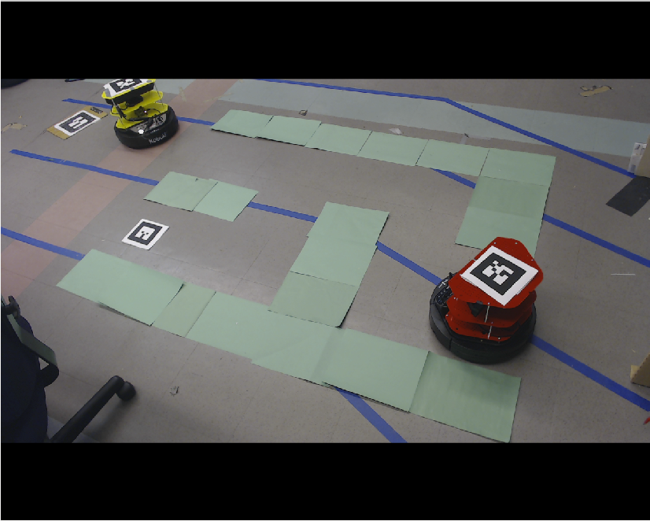

Using the image provided by the camera, we transform it into a binary image.

IMPORTANT NOTE: The images here were captured before the segmentation of the AR Tag was completed, so the turtlebot will have a large unsegmented portion in these images. If you want to see that this works, check the last video on our results page. 

1. Segment image using color thresholding to get the walls of the maze.
    - Thresholds for colors picked through trial and error.
    - Works best if the markers contrast strongly with everything else in the camera view.
    - Apply morphological transform in Opencv to remove noise in image.

    

    
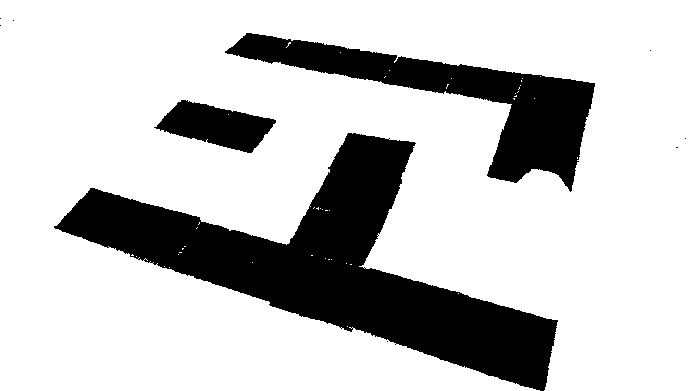

    

2. Assume maze is going to be bounded by bounded by a well-formed rectangle.
    - Not strictly necessary in that only the pieces of paper corresponding to the rectangle’s corners need to exist.
    - If there are boundaries, however, they need to be relatively straight and not too spaced apart.
3. Detect potential clusters of corners in segmented image, and refine them to get corner pixels.

    

    
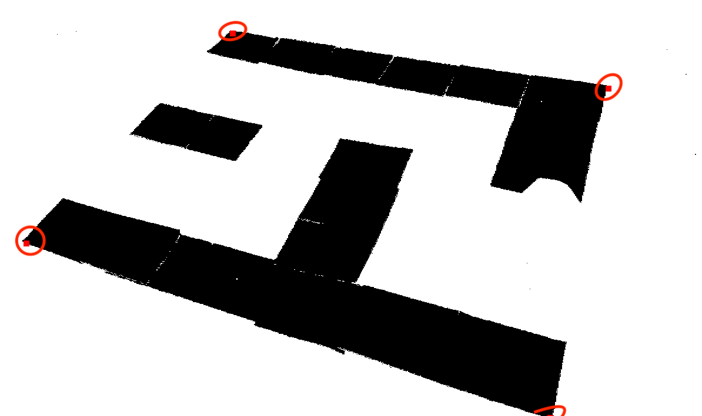

    

4. Use K-means clustering on convex hull of corners to separate points into four groupings.
    - Depending on the angle of the camera, the shape of the maze can look like a trapezoid, parallelogram, rectangle, etc.
    - Depending on distance of camera to the maze, maze can also be translated.
    - Difficult to find a good method to classify outermost corners of maze after classification.
    - Becomes easier to find a method if we only consider clusters in a local region.
    - K-means allows a flexible way to split the maze into four quadrants, regardless of the camera’s position or orientation.
5. In each cluster, pick point that is furthest away from center of convex hull of points.

    
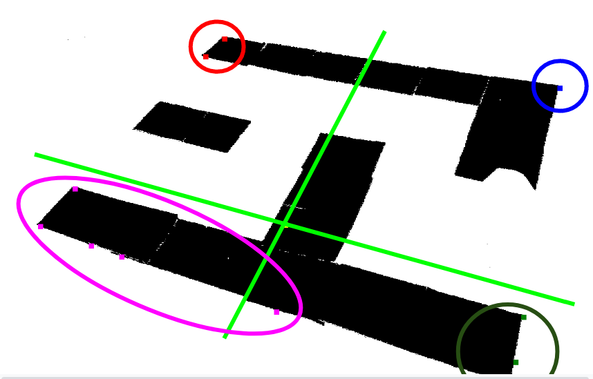

6. Have (ideally) found four corners of a rectangle, apply median filter to corners to reduce chance of outliers.
7. Find maximum bounding rectangle
8. Retrieve perspective transform matrix, and apply to segmented image and original image.
9. Segment turtlebot in the transformed original image.
    - Use color thresholding on turtlebot (black for base and whatever color the Turtlebot is)
    - Segment AR Tag on turtlebot by calculating corners of tag in AR tag frame, transforming to camera frame, transforming to pixel space, transforming to warped pixel space, and then drawing a rotated rectangle contour around corners using OpenCV.
10. Overlay segmented Turtlebot with segmented maze.

    

    
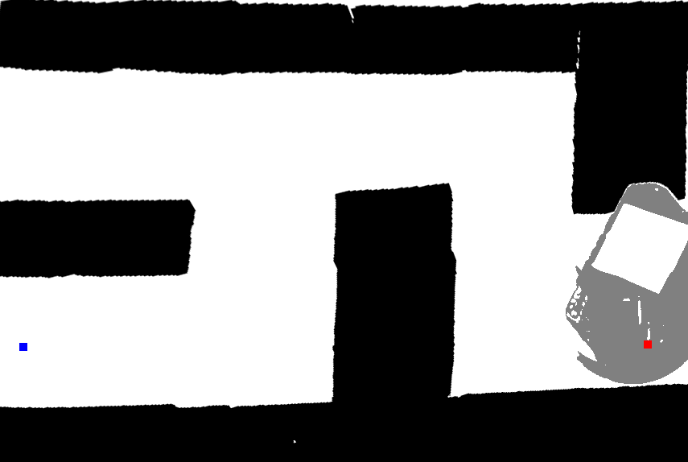

    

11. Downsample image to get 2D-grid for path planning.
12. Assign walls a 1, open space a 0, and the region covered by the Turtlebot as a 2 (internally).
    - Compare to internalized grid (initially all 2s).
    - Only change internal grid points’ values if new corresponding grid point is a 1 or 0
    - If turtlebot drives and blocks a portion of the maze we knew prior, safest to assume it does not change as the Turtlebot blocks it from the camera’s view.
    - If Turtlebot moves and no longer blocks part of the maze, we now know what that that part of the maze looks like, and there is not reason to make it uncertain.
    - Only change maze if someone alters the walls.
13. Publish uncertain regions as 1 (wall).
    - Assume turtlebot will not initially cover optimal path (can deal with this but ran out of time)
    

    
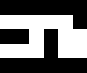

    

14. Get pixel position of goal, base of Turtlebot, and AR tag on turtlebot using TF and applying camera intrinsic matrix.
15. Get transform between Turtlebot and Goal using TF.
16. Publish updated internal grid, pixel positions, and Transformations

[(back to top)](#table-of-contents)

## Planning

We used A* to find the shortest path from the start position to the end position

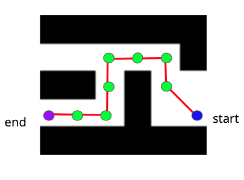

We preprocessed the path return by A* such that it only contained the turning points.

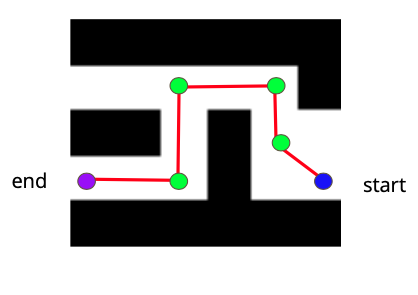

[(back to top)](#table-of-contents)

## Control

At turning points, we calculated the angle difference between the current state (x, y, ɵ) to the desired angle. Current angle with respect to the fixed from is obtained from look_up_transfrom from tf package. The desired angle is calculated from based on the path.

The twist published only contains angular velocity Kz &Delta;&theta;

&Delta;&theta; = &theta;d - &theta;0

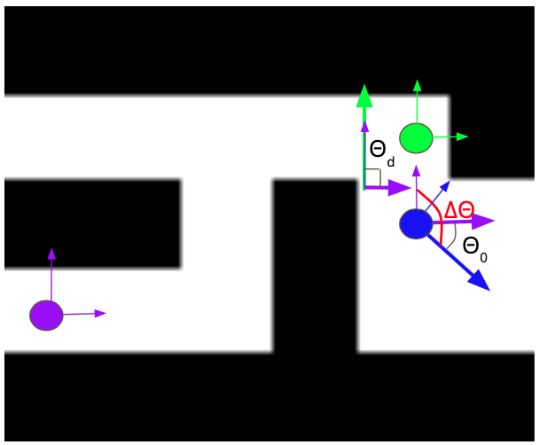

Between turning points, the main motion was translation. We still took
consideration of small angle differences. A proportional control was used.

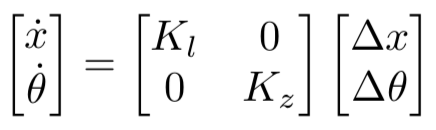

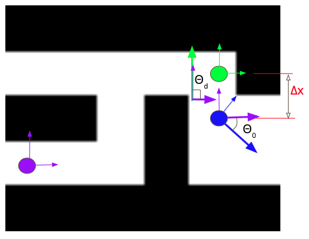

Near the goal position, the goal AR tag sometimes was covered by the TurtleBot.
We assumed that the goal position could not change any more. Then, we solved it
in two ways. One was to estimate the distance and publish the previous twist
certain times (i.e. 40 times). The other one was to modify the message received
from vision. When the goal AR tag was not seen, assume the position was the same
as the previous location.

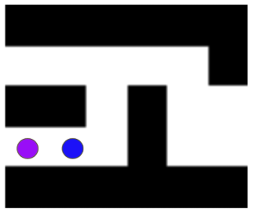

[(back to top)](#table-of-contents)
