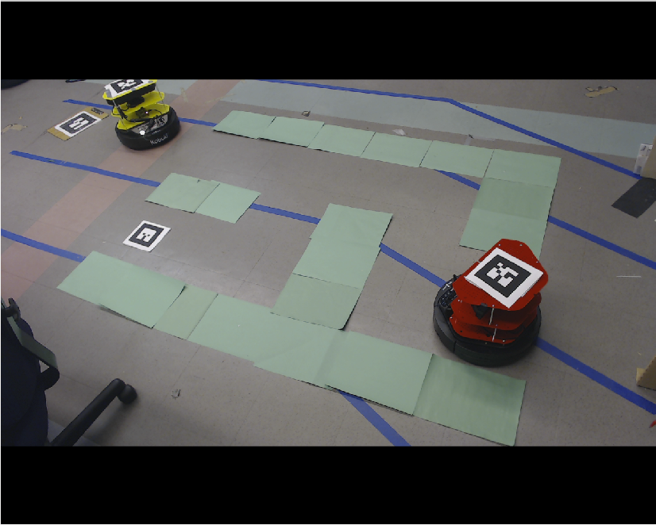
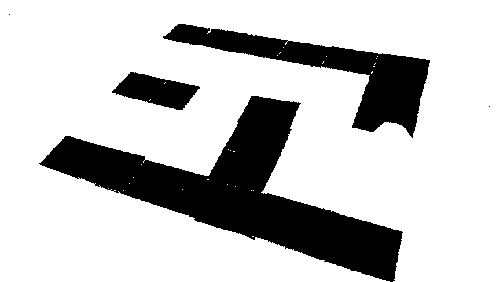
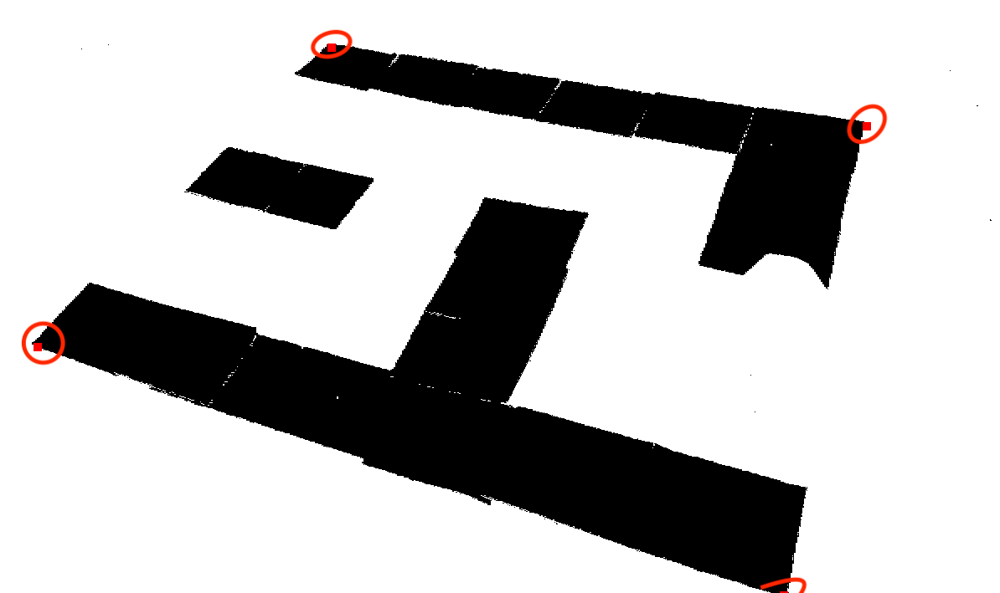
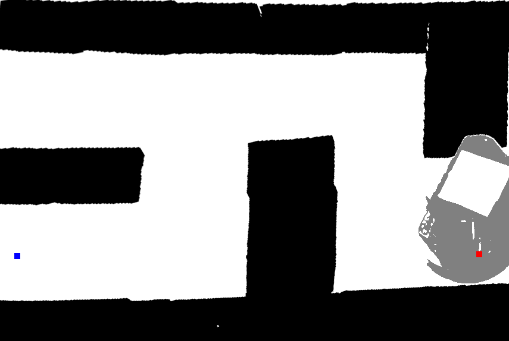
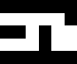

# Vision
There were two AR tags, one will be on the Turtlebot, the other one will put in the maze. With the help of the camera on the side to provide information of the maze and the position of the Turtlebot and the goal by using both AR tags.

Using the image provided by the camera, we transformed it into a binary image.

The binary image made it easier to detect corners of the maze, and then using OpenCV transform the image to a top down view.

We also used static transform to provide the actual position of the Turtlebot(the "base_link") since the AR tag is on the Turtlebot.

As shown below, the blue dot is the position of the goal AR tag, and the red dot is the postion of the Turtlebot.

Lastly, by downsampling to the grid size, we made the maze into grids, and we used an array to represent the maze. Publish the maze array, the goal position, and the TurtleBot position to the controller.

{:height="150%" width="150%"}
