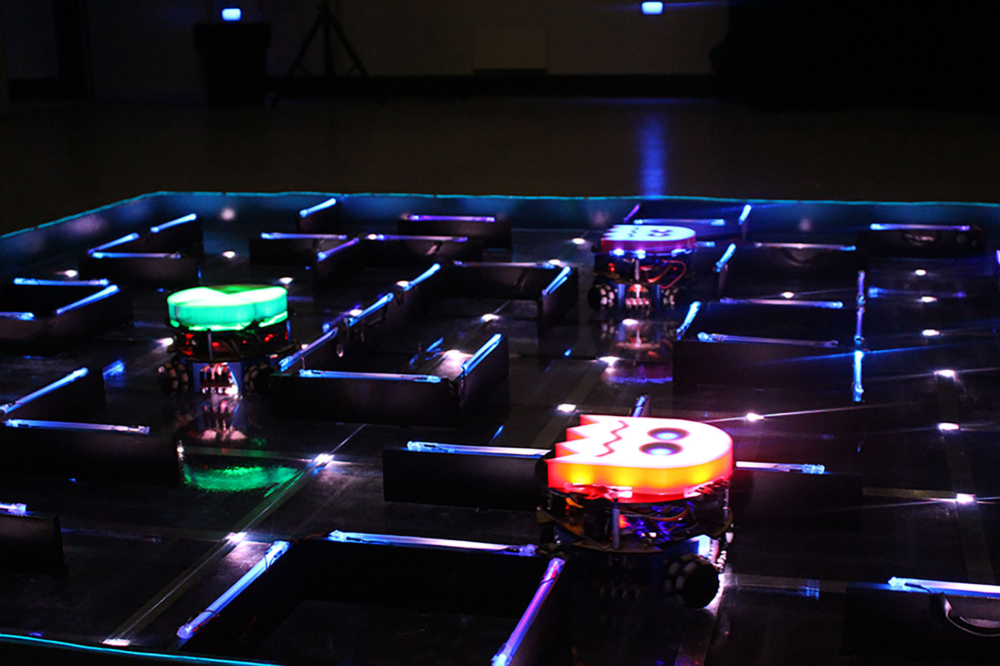
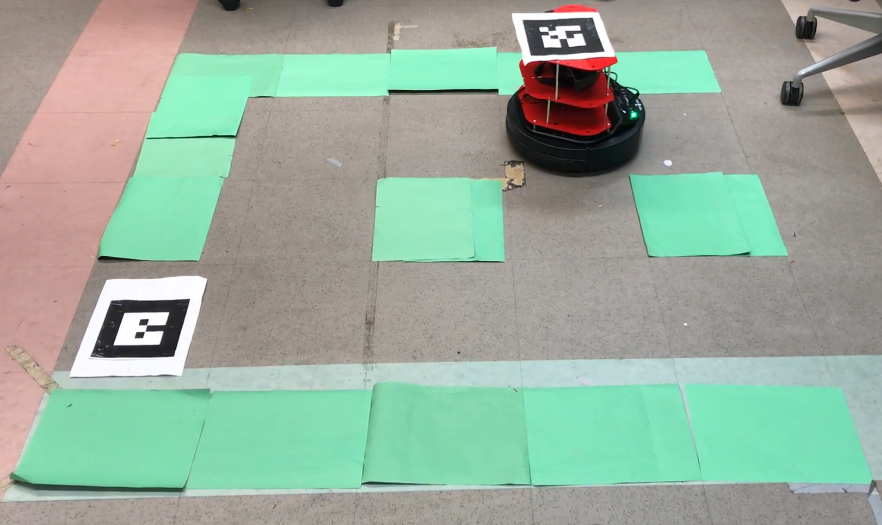
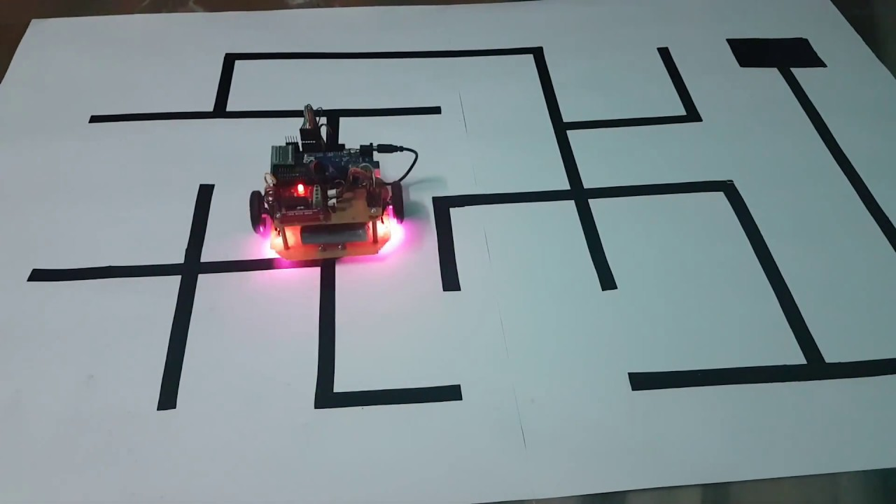
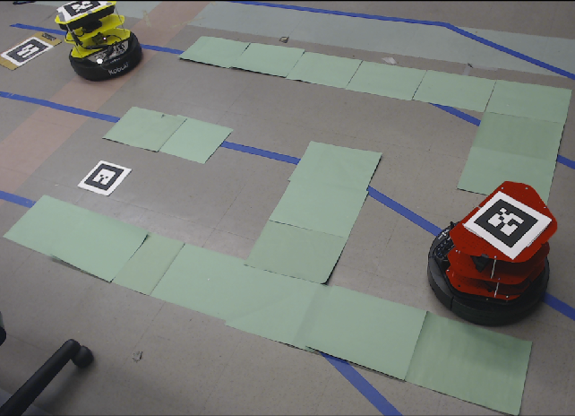
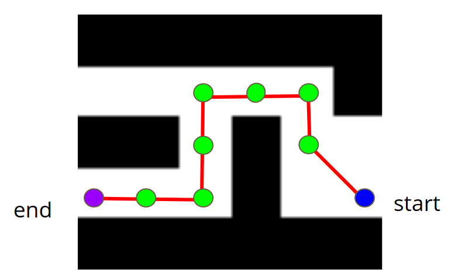

---
# Feel free to add content and custom Front Matter to this file.
# To modify the layout, see https://jekyllrb.com/docs/themes/#overriding-theme-defaults

layout: page
title: Introduction

---
<link href="assets/stylesheets/main.css" rel="stylesheet">
#  Welcome to the Maze Runner Bot Website! 

This website is meant to document and showcase a final project for the introductory robotics course (EEC106A) at UC Berkeley. This page provides a general introduction and summary of the project.

---
# Table of Contents
1. [What are we even doing?](#what-are-we-even-doing)
2. [Why do we even care?](#why-do-we-even-care)
3. [How the heck is this even useful?](#how-the-heck-is-this-even-useful)

---

# What are we even doing?

The original goal of our project was to do some cool pacman thing that involved multiple robots interacting with each other in a three-dimensional maze. The "Pac-Man" Turtlebot would use feedback from an external camera to explore the maze, while the "ghost" Turtlebots would use SLAM to navigate the level and search for "Pac-Man".

*
this is how it looked in my head i swear (<a href="https://www.createunsw.com.au/projects/pi-robotic-pacman/">source</a>)
*

We broke the problem down into several small milestones, and came up with a timeline to accomplish them. However, once we seriously started working on the project, we realized that our original objective was sort of way too difficult for us to complete in the allotted time. In response to this realization, we scaled the project down to our first milestone: **<u>Having a Turtlebot follow a constrained path to a goal in a two-dimensional maze, using video feedback from an external camera.</u>** Additionally, we required that the robot dynamically respond to changes in the goal and changes in the maze. Finally we wanted the robot to be unaffected by any movement in the external camera (provided the entire maze + robot was still being captured in the view of the camera).

*
expectation vs reality
*

[(back to top)](#table-of-contents)

# Why do we even care?
A quick google search will tell you that there are many projects (so, so many) that have a robot navigate a maze. So what makes our project different?

Firstly, most projects that we managed to find online solve a carefully constructed maze in a highly-controlled environment. Though our project has significant constraints on the environment (which will be explored on the "Design" page), all you really need to do to build a maze is lay out some high contrast paper on the ground. This is a relatively minor difference, but it allows a degree of portability that would not otherwise be possible.

*
Carefully controlled background. Might be difficult to move/scale up. (<a href="https://www.youtube.com/watch?v=Jjuc5SBl25w">source</a>)
*

*
Can literally just lay green paper wherever you want (kind of).
*

Secondly, many (though not all) maze-solving robots work in an exploratory fashion. The robot navigates the maze, using cameras mounted on the robot itself, and builds an internal map to eventually reach the goal. While this approach has its own set of challenges and applications, our group elected to use an external camera that has a view of the entire maze. This allows us to find a path through the maze before sending control commands to the robot. In this approach, the robot does not waste any time exploring dead ends, and immediately follows the shortest path.

*
Path is generated before the robot ever moves.
*

Thirdly and finally, the Maze Runner Bot navigates the maze dynamically. This means that if the goal or maze changes, the robot should be able to react properly and still reach the goal (provided a path exists). As far as we could tell, most other projects do not do this. Having this dynamic control makes the problem significantly more challenging, as the robot needs to have a very precise notion of its location in the maze in order to not go through the walls of the maze or get stuck. With this requirement we also needed to continuously process the feedback from the camera to detect if something changed. This meant that the vision had to be extremely robust and accurate.

[(back to top)](#table-of-contents)

# How the heck is this even useful?

In terms of real world applications, a possible use of our project (with some serious adjustments and further research) would be to have robots navigate to different goals in a warehouse. The idea would be to use high contrast markers on the floor, along with a series of cameras mounted in various locations, to guide the robot(s).

[(back to top)](#table-of-contents)
